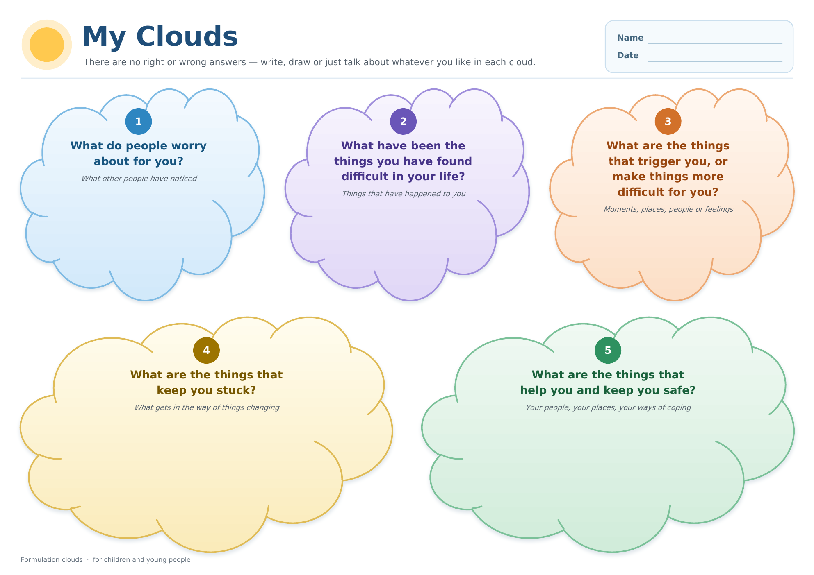

# My Clouds — CYP Formulation Clouds

A redesign of the *CYP Formulation Clouds* worksheet: the same five questions,
laid out to be calmer, clearer and friendlier for a child or young person to
sit with.

## Files

| File | What it's for |
|---|---|
| `CYP_Formulation_Clouds.docx` | The worksheet. Every cloud is a real Word shape with editable text, so it can be printed and written on, or typed into on screen. |
| `CYP_Formulation_Clouds.pdf` | Print-ready copy. |
| `preview.png` | The page as an image. |
| `build_clouds.py` | Regenerates the `.docx` from scratch — `python3 build_clouds.py`. No dependencies. |

## What changed, and why

**Layout.** The original clouds overlapped each other and their captions sat in
bordered boxes that clipped the text mid-word. Here the five clouds sit on a
clean three-over-two grid with clear space between them, and every question is
inside its own cloud with room left underneath to write or draw.

**Order.** The questions now run in the order a formulation is usually talked
through — worries, what's been hard, triggers, what keeps things stuck, and
what helps — numbered 1 to 5 so a young person can move through them. Ending on
"what helps and keeps you safe" is deliberate; that cloud and the one before it
are the widest on the page.

**Colour.** Each cloud has its own soft colour instead of five identical blues,
so they are easy to tell apart and refer to. Question text is a deep tint of the
same hue. Every text/background pair on the page clears WCAG AA — the tightest
is 4.7:1 for the italic prompts, against a 4.5:1 bar; the white numerals in the
badges range 3.4–5.8:1 against the 3:1 bar for large bold text. The heavy black
outlines and drop shadows are gone.

**Type.** Trebuchet MS throughout — rounded, humanist and on the British
Dyslexia Association's list of accessible typefaces, and present on every
Windows and Mac. Questions are 16 pt with generous line spacing; each has a
small italic prompt underneath giving an example of what might go in.

**Framing.** A title, a line saying there are no right or wrong answers, and a
name/date box. Wording of the questions is unchanged apart from joining the two
sentences of the triggers question with a comma.

## Notes

- Page size is A3 landscape (420 × 297 mm), as in the original. It scales down
  to A4 cleanly if that is what is to hand.
- The page is left white rather than tinted, so it prints without soaking a
  sheet in ink.
- The clouds are deliberately left empty rather than ruled, so they can be
  drawn in as well as written in.
